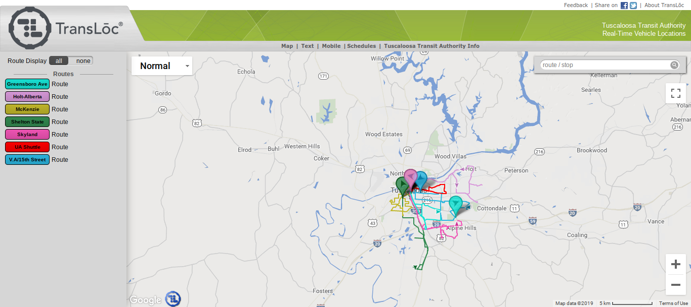
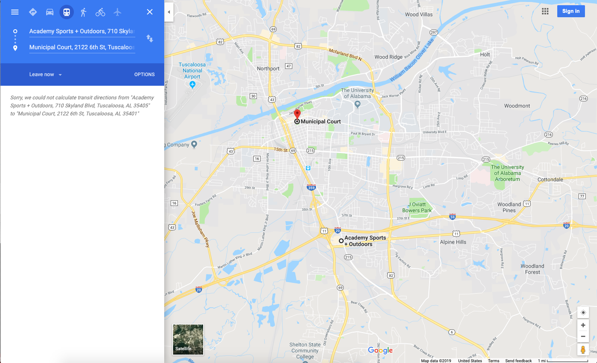
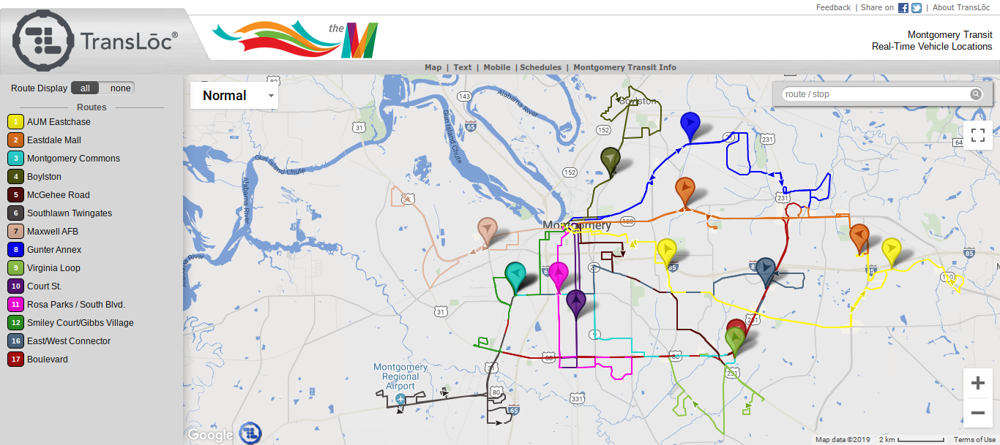
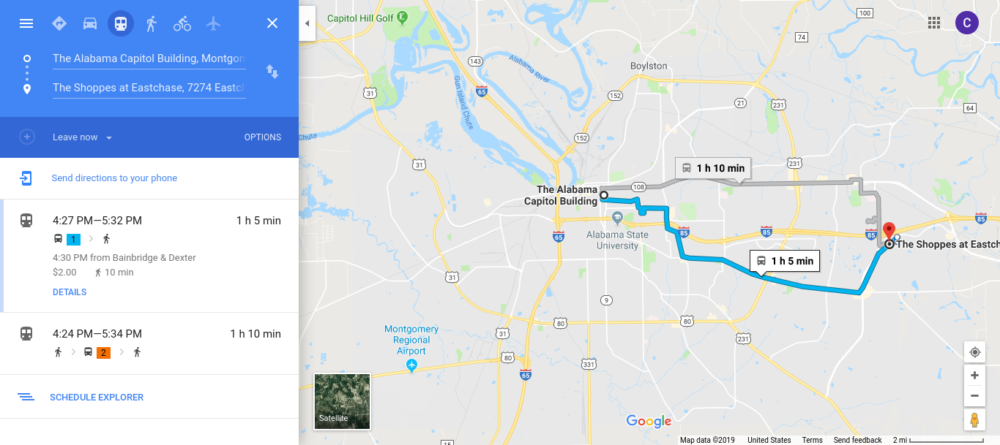
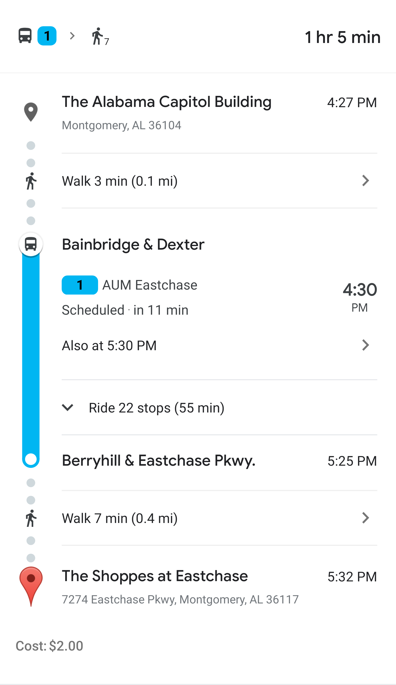

# Integrate Tuscaloosa Trolley with Google and Apple Maps

### Opportunity
Exposing the Tuscaloosa Trolley information to Google and Apple maps, using available technology Transloc Architect.
*  for directions in Tuscaloosa, the Trolley rides will be displayed along side driving, walking, and carpooling services (Uber and Lyft).
* The  
* Tuscaloosa Trolley will be competitive with other 

# Tuscaloosa 

Searching for routes on Tuscaloosa trolley requires dowloading the 
* Transloc Rider App from [AppStore](https://apps.apple.com/us/app/transloc-rider/id751972942) on iOS
* Transloc Rider form [Google Play](https://play.google.com/store/apps/details?id=com.transloc.android.rider) on Android
* Or visiting tuscaloosatransit.transloc.com from 

### Disadvantages of the Transloc website/app:
* User can only search for trolley stops.
* Users cannot get predictions for walking times from current location using GPS.
* Alternative routes and bus transfers must be searched for manually.
* Many users are not familiar with these sites or apps.

When searching Google for a directions within Tuscaloosa no public transportation options are displayed, despite the Tuscaloosa Trolley servicing this route. See following example:
 * From: Municipal Court, 2122 6th St, Tuscaloosa, AL 35401
 * To: Academy Sports + Outdoors, 710 Skyland Blvd, Tuscaloosa, AL 35405 
 * Google Maps: Does not display public transportation 

# Montgomery (by comparison)

Montgomery, which also appears to use Transloc services. 
* Montgomery Transloc

However, Montgomery also seems to integrate with external sites such as Google maps.

When Searching for directions within Montgomery, public transportation is displayed.
* From: The Alabama Capitol Building, Montgomery, AL 36104
* To: The Shoppes at Eastchase, 7274 Eastchase Pkwy, Montgomery, AL 36117
* Google Map: Displays two choices with options 

* 
